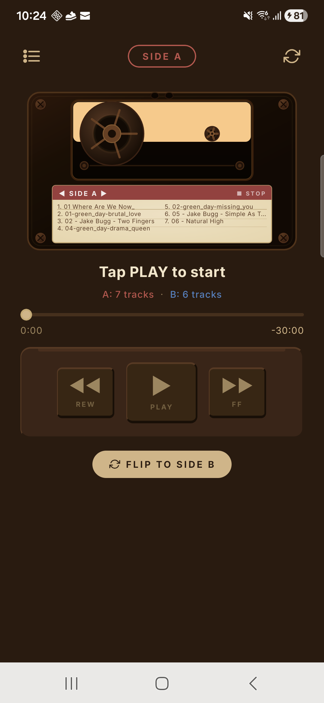
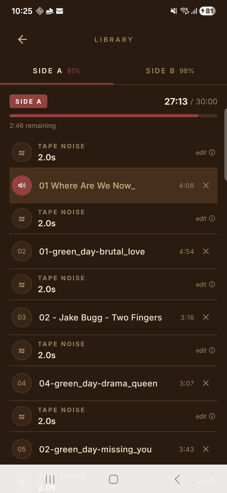
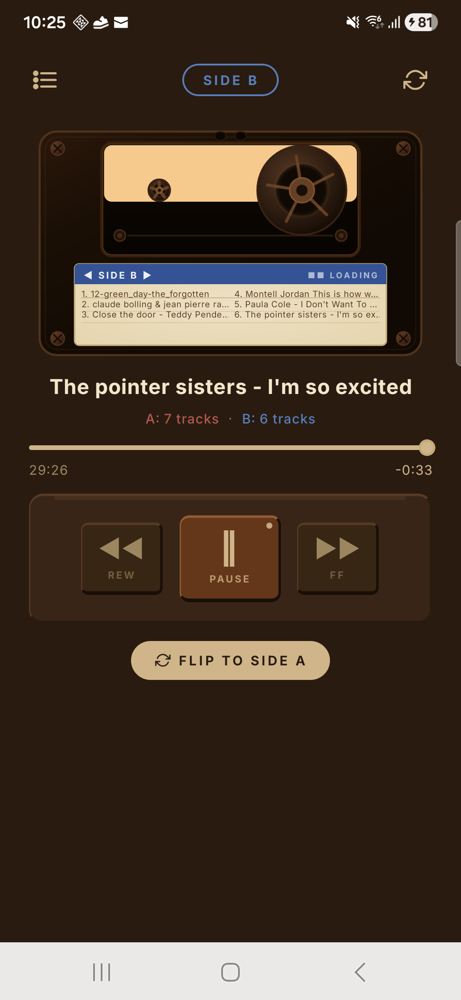

# Cassette — No Skip

> A retro cassette tape music player for Android. No skip button. No algorithm. Just your music, played all the way through.

[한국어 README →](./README.ko.md)

---

## What is this?

Remember when you actually listened to a whole song?

Cassette Player brings back the era when music wasn't something you scrolled through — it was something you sat with.

Load your own music onto Side A or Side B (30 minutes each, just like a real tape). Hit play. And stay with it.

**No skip button.**
Want to move forward? Hold FF — just like the real thing.

**Tape noise between tracks.**
That hiss isn't a bug. It's the texture of analog.

**Side A + Side B. 60 minutes total.**
Curate what actually matters to you.

**Your files only.**
No streaming. No algorithm deciding what you hear next. Just you and your music.

In a world of infinite playlists and 10-second attention spans, Cassette Player dares you to slow down.

You might rediscover a song you always used to skip past.

---

## Screenshots

<p align="center">
  
  &nbsp;&nbsp;
  
  &nbsp;&nbsp;
  
</p>
<p align="center">
  <em>Player (Side A) &nbsp;·&nbsp; Library &nbsp;·&nbsp; Player (Side B, Playing)</em>
</p>

---

## Features

- **No Skip Button** — hold FF to fast-forward, just like a real cassette tape
- **A/B Side System** — 30 minutes per side, curate what goes on each
- **Tape Noise** — authentic tape hiss plays between every track
- **Cassette Flip Animation** — smooth scaleX flip when switching sides
- **Realistic Spool Animation** — reel rotation speed is physically accurate (smaller radius = faster spin)
- **Background Audio** — keeps playing when the screen is off (Foreground Service on Android)
- **Track Persistence** — your track list is saved across app restarts
- **FF / REW** — fast-forward and rewind with real tape sound effects
- **Vintage UI** — warm brown/beige color theme inspired by 1980s cassette players
- **Local files only** — your music, no subscriptions, no internet required

## Tech Stack

| Category | Package |
|---|---|
| Framework | Expo SDK 54 (React Native) |
| Audio | expo-av |
| Animation | react-native-reanimated |
| SVG UI | react-native-svg |
| File Picker | expo-document-picker |
| Background Service | expo-notifications (Foreground Service) + custom WakeLock module |
| Persistence | @react-native-async-storage/async-storage |
| Haptics | expo-haptics |

## Project Structure

```
artifacts/cassette-player/
├── app/
│   ├── player.tsx          # Main player screen
│   └── library.tsx         # A/B track management
├── components/
│   ├── CassetteTape.tsx    # SVG cassette body (gradients, screws, rollers, label)
│   ├── Spool.tsx           # Animated reel with physics-based rotation
│   ├── ControlButtons.tsx  # Playback controls (Play, Pause, FF, REW, Flip)
│   └── ProgressBar.tsx     # Track progress display
├── hooks/
│   └── useAudioPlayer.ts   # Core playback logic (A/B sides, tape noise, persistence)
├── utils/
│   └── wakeLock.ts         # Android WakeLock + Foreground Service bridge
└── tools/
    ├── build-apk.sh        # APK build script (direct install)
    └── build-store.sh      # AAB build script (Play Store)
```

## Getting Started

### Prerequisites

- Node.js 20+
- pnpm
- Android device or emulator

### Installation

```bash
git clone https://github.com/hyunseokyu1-netizen/cassette-music-player.git
cd cassette-music-player
pnpm install
cd artifacts/cassette-player
pnpm install
```

### Run

```bash
# Connect device first
adb reverse tcp:8081 tcp:8081

# Build & install on Android
npx expo run:android
```

### Build for Play Store

```bash
# AAB (Play Store upload)
./tools/build-store.sh

# APK (direct install / testing)
./tools/build-apk.sh
```

Output: `artifacts/cassette-player/android/app/build/outputs/bundle/release/app-release.aab`

## How to Use

1. Open the **Library** tab
2. Tap **+ Add** on **Side A** or **Side B** to add your music files
3. Go back to the **Player** tab
4. Press **Play** — the cassette reels will start spinning
5. Hold **FF** to fast-forward through a track (no instant skip)
6. Use the **Flip** button to switch between Side A and Side B

## Notes

- Local MP3/audio files only — no streaming support (by design)
- Background audio handled via `expo-notifications` Foreground Service + `PARTIAL_WAKE_LOCK` to survive Android Doze mode
- See [`tools/BACKGROUND_AUDIO.md`](./tools/BACKGROUND_AUDIO.md) for implementation details that shouldn't be changed

## License

MIT
